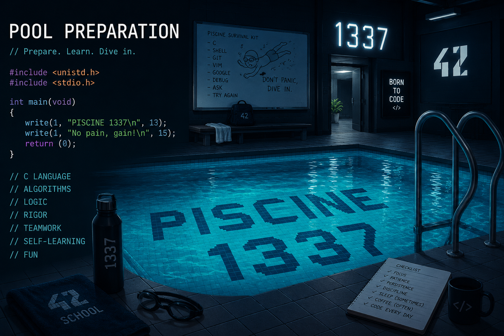

# 1337 Pool Prep 🏊🏻‍♀️👨🏿‍💻

- **Author:** Outaouss
- **School:** 1337 Khouribga

`Contact Me :`

- DISCORD USERNAME : **@spl1nt4**
- DISCORD ID : **576600238681358339**

## About

This repository is made for new poolers to help them prepare for the Piscine (Pool) at 1337 Khouribga.

It contains subjects and exercises covering:

- **C00** → **C09** (daily exercises)
- **Exam00**
- **Exam01**
- **Exam02**
- **ExamFinale**

## Goal

The purpose of this repo is to give future poolers a resource to practice with before starting the pool, so they can get familiar with the exercises and exam formats.

## Usage

Browse through each day's folder (C00 to C08) to find the exercises, and check the Exam folders to see what the exam subjects look like.

Good luck to all the future poolers 🐟
